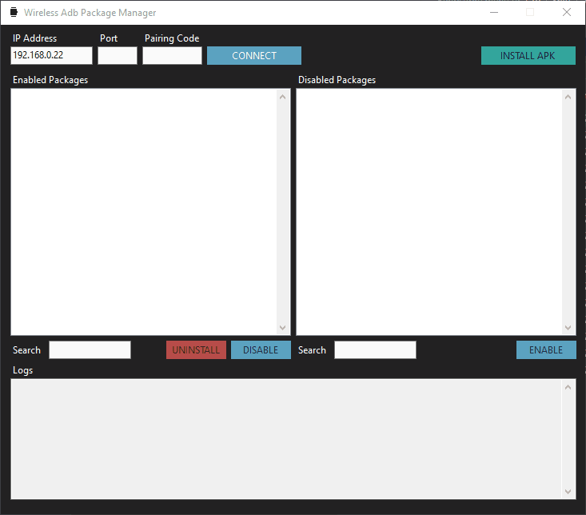

# Wireless Adb Package Manager

A small Windows GUI for ADB that streamlines wireless pairing/connecting to Android devices and lets you install APKs, enable/disable, and uninstall installed packages — designed with Samsung Galaxy Watches and other WearOS devices in mind for sideloading and bloatware removal.

## Download

Grab the latest single-file `.exe` from the [Releases](https://github.com/niftiest/Wireless_Adb_Package_Manager/releases) page. No installer, no .NET runtime needed.

## Usage

1. On the Android device: enable **Developer Options**.
2. Enable **Wireless debugging** under Developer Options.
3. Tap **Pair device with pairing code**. Note the IP, port, and 6-digit code shown.
4. In the app: enter that IP, port, and pairing code, then click **CONNECT**.
5. After pairing succeeds, return to the **Wireless debugging** screen on the device, copy the *connection* port shown next to the IP, update the port in the app, and click **CONNECT** again.
6. Install, enable, disable, or uninstall packages as needed. Use the search boxes to filter.

## Building from source

Requires the .NET 8 SDK on Windows.

```bash
dotnet build -c Release
dotnet test
dotnet publish src/WirelessAdbPackageManager -c Release -r win-x64 --self-contained -p:PublishSingleFile=true -p:IncludeNativeLibrariesForSelfExtract=true -o publish/
```

## License

[MIT](LICENSE)
